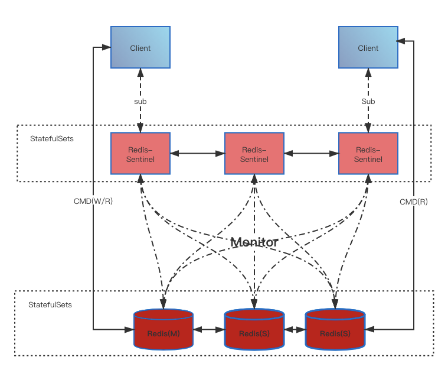
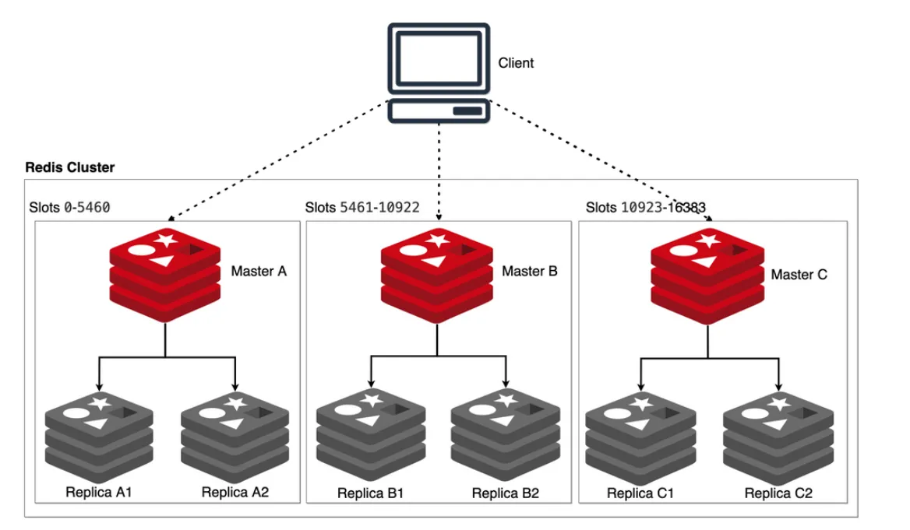

# Architecture

Alauda Cache Service for Redis OSS provides two Redis management architectures to meet the high availability requirements of different scenarios based on customer pain points.

- Sentinel Mode: This mode includes one Redis master node and a configurable number of one or more replica nodes. The replica nodes are used for read operations and stay in sync with the master node to ensure high availability. Sentinel mode offers read scalability and can be used in conjunction with Redis Sentinel for automatic failover and high availability.
- Cluster Mode: This mode is a distributed architecture that allows data sharding across multiple Redis nodes. Cluster mode provides read and write scalability, automatic failover, and data partitioning capabilities, resulting in higher performance and availability.

## Sentinel Mode

Sentinel mode is a high-availability solution based on master-slave replication provided by Redis. By monitoring the Redis instances' status, Sentinel mode can automatically promote a replica node to a master node in the event of a master node failure, ensuring service availability. The main features of Sentinel mode are as follows:

- Easy to use: Compared to cluster mode, implementation and management are relatively straightforward.
- High availability: Supports automatic failover of nodes, providing highly available data services.
- Limited scalability: Supports only master-slave replication and cannot scale horizontally like cluster mode.
- Single point of failure: Sentinel nodes themselves can also fail; thus, the high availability and fault tolerance of the sentinel nodes need to be considered.

## Cluster Mode

Cluster mode is the core of Redis's distributed solution. Through Redis Cluster, we can achieve horizontal scaling of Redis by distributing data across multiple nodes, using sharding technology and consistent hashing algorithms to automatically partition and balance data. The main features of cluster mode are as follows:

- High availability: Supports automatic recovery of node failures, ensuring high availability of data services.
- Horizontal scaling: Supports dynamic scaling up and down of nodes, allowing adjustments to the number of nodes based on business needs.
- Load balancing: Balances node loads to avoid scenarios where a single node is overloaded.
- Data dispersion: Distributes data across multiple nodes, preventing issues with excessively large data on a single node.
- High complexity: Requires consideration of sharding, consistent hashing, data migration, and node balancing issues, making implementation and management relatively complex.

## Architecture Selection

|      | Requires infinite horizontal scaling capability | Single node or small node deployment | Large data storage scale (over 8GB) | High availability |
| :--- | :----------- | :--------- | :-------------- | :-- |
| Sentinel Mode |              | ✓          |                 | ✓   |
| Cluster Mode | ✓            |            | ✓               | ✓   |
