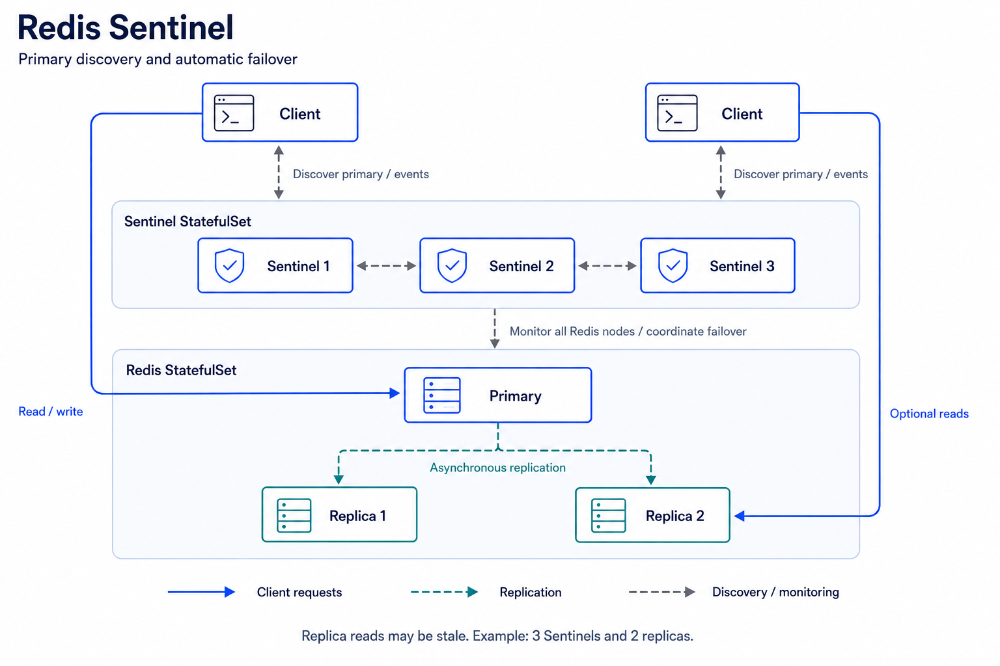
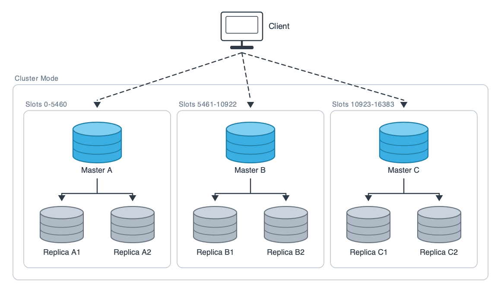

Alauda Cache Service E1 offers two distinct deployment architectures, each designed to address specific performance, scalability, and high-availability requirements.

- **Sentinel Mode**: A high-availability configuration consisting of a primary Redis instance and configurable replica nodes. Replicas receive updates asynchronously and can serve reads, which may return stale data. Redis Sentinel monitors instance health and orchestrates automatic failover when necessary.

- **Cluster Mode**: A distributed architecture that implements horizontal scaling through data sharding across multiple Redis nodes. This configuration provides enhanced read/write throughput, automatic failover capabilities, and intelligent data partitioning for optimal performance and availability in high-scale environments.

## Sentinel Mode \{#sentinel-mode}

Sentinel Mode implements a high-availability solution based on Redis's native primary-replica replication. Redis Sentinel monitors the Redis nodes and can promote a replica to primary when the primary fails and the required quorum and majority authorization are available. Key characteristics include:

- **Operational Simplicity**: The architecture offers straightforward implementation and management compared to distributed clustering solutions.
- **Automated Failover**: Sentinel detects primary failures and coordinates replica-to-primary promotion.
- **Vertical Scaling**: While supporting vertical resource scaling, this architecture has limited horizontal scalability as all write operations must be directed to the primary node.
- **Sentinel Resilience**: For complete high availability, multiple Sentinel instances must be deployed to avoid introducing the Sentinel itself as a single point of failure.

Clients use Sentinel to discover the current primary and connect directly to Redis for data operations. Event subscriptions can help clients react to topology changes. The diagram shows example node counts; replica reads are optional and may be stale. See the [Sentinel client specification](https://redis.io/docs/latest/develop/reference/sentinel-clients/) for discovery and reconnection behavior.

## Cluster Mode

Cluster Mode distributes keys across 16,384 hash slots. Each primary owns a subset of these slots and replicates its data to replicas within the same shard. Cluster-aware clients route commands to the primary responsible for the key's slot. Redis Cluster uses hash-slot sharding, not consistent hashing; see the [Redis Cluster specification](https://redis.io/docs/latest/operate/oss_and_stack/reference/cluster-spec/). Key characteristics include:

- **High Availability**: The architecture implements automatic node failure detection and recovery mechanisms, ensuring continuous data service accessibility.
- **Dynamic Scaling**: Supports runtime addition or removal of nodes with automatic data rebalancing to accommodate changing workload requirements.
- **Client Routing**: Cluster-aware clients use the slot-to-node mapping and handle `MOVED` and `ASK` redirections when the topology changes. Workload balance depends on key distribution and access patterns.
- **Data Distribution**: Partitions datasets across multiple nodes, preventing single-node memory constraints and enabling support for substantially larger total datasets.
- **Operational Complexity**: Requires understanding of hash-slot allocation, data migration strategies, and cluster topology management.

The diagram shows three example shards with two replicas per primary. The slot ranges cover the complete keyspace without overlap. Cluster bus connections between nodes are omitted to keep client routing and primary-replica replication readable.

## Architecture Selection Guide

| Requirement | Sentinel Mode | Cluster Mode |
| :---------- | :------------: | :----------: |
| Horizontal scalability beyond single-node memory limits | ❌ | ✅ |
| Simplified deployment and management | ✅ | ❌ |
| Support for large datasets (>8GB) | ❌ | ✅ |
| High availability with automatic failover | ✅ | ✅ |
| Optimized for read-heavy workloads with read replicas | ✅ | ✅ |
| Support for transaction operations across multiple keys | ✅ | ❌* |

\* *Redis Cluster has limitations on multi-key operations when keys belong to different hash slots*
