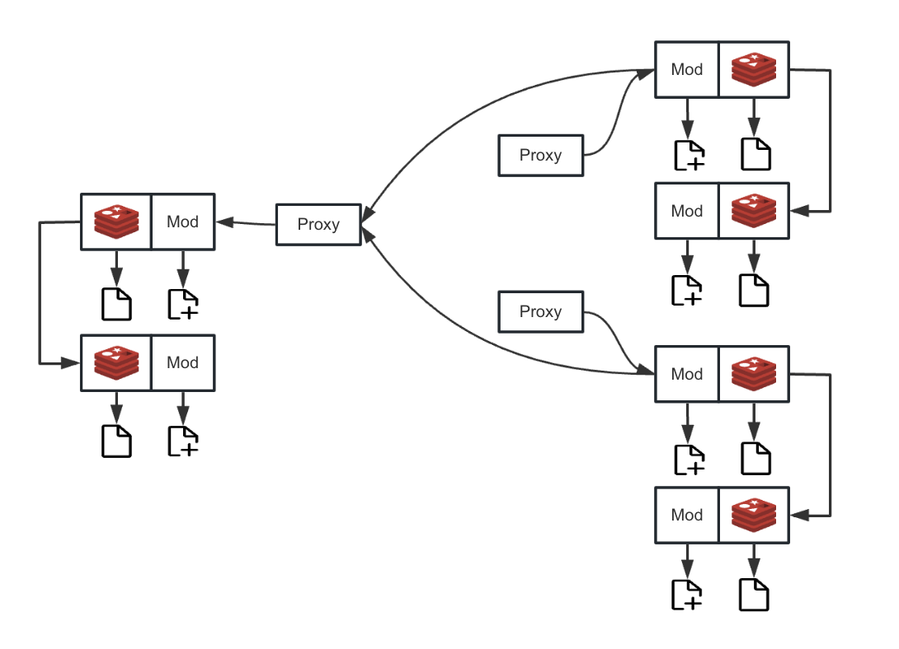
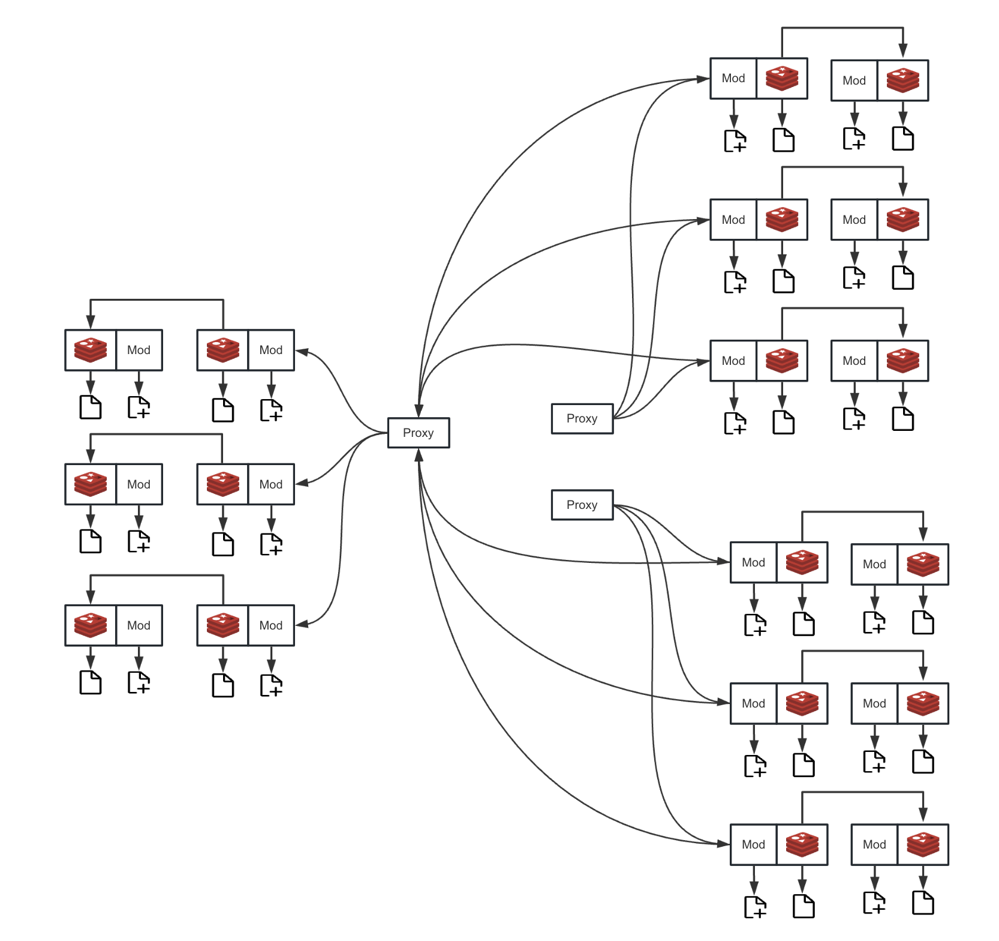

# Disaster Recovery

<Directive type="warning" title="Feature Maturity Notice">
The disaster recovery feature is currently in `alpha`. If you plan to use this solution in a production environment, please use it in conjunction with features such as alerting and regular backups. At the same time, disaster recovery switching requires manual intervention to prevent data loss due to unknown issues.
</Directive>

**Alauda Cache Service for Redis OSS** disaster recovery system is an enterprise-level, high-performance, and high-reliability data protection solution developed based on the extension capabilities of Redis Modules. The current version mainly supports Redis 6.0, and achieves more powerful functions through a small number of intrusive modifications to the source code. This design enables it to accurately capture, transform, and control data operations at the kernel level.

### Technical Overview

The core functions of the system cover the entire disaster recovery link, including data interception, command parsing, operation log (Oplog) persistence, full and incremental data synchronization, and log slicing. The workflow begins with intercepting all write operations at the command execution entry point. Subsequently, the system deeply parses the commands and converts them into an idempotent, structured Oplog format. These logs are efficiently persisted to the local disk, forming a complete and reliable history of data changes, which provides a solid foundation for subsequent data recovery and failover.

In terms of data synchronization, the system has designed a synchronization mechanism that is both efficient and flexible. It supports full synchronization, which quickly builds a complete data copy on the standby side by generating an RDB snapshot and combining it with the starting position of the Oplog. More importantly, we have innovatively introduced an Offset mechanism that is tightly integrated with the Oplog, building an incremental synchronization capability with an ultra-large window period. Unlike Redis's native replication, which relies on a limited memory backlog, our Oplog is persisted on disk, which means that the catch-up range of incremental synchronization is limited only by disk space. Therefore, even if a network interruption of several hours or even days occurs between the primary and standby instances, once the connection is restored, the standby side can still request incremental data from the last recorded Offset point, achieving efficient data catch-up and consistency recovery, which greatly improves the reliability and robustness of the disaster recovery architecture.

In addition, in order to ensure the long-term stable operation of the system and controllable resources, we have designed a refined log slicing function. This function will automatically scroll and segment the local Oplog file according to the preset size policy. This mechanism not only effectively prevents a single log file from growing indefinitely and exhausting storage resources, but also greatly facilitates the archiving, cleaning, and management of logs, which is a key part of ensuring the continuous and stable operation of the disaster recovery service in a production environment.

Finally, the system provides comprehensive and powerful observability. By comparing the latest write position of the primary Oplog with the synchronized Offset of the standby in real time, the system can accurately calculate the data synchronization delay between the primary and standby with extremely low overhead. These key performance indicators (KPIs) can be seamlessly connected to mainstream monitoring panels (such as Prometheus/Grafana) and alarm systems. This allows the operation and maintenance team to grasp the system health status, synchronization link status, and data differences in real time and intuitively, so as to intervene in a timely manner before potential risks evolve into actual failures, which effectively guarantees business continuity and data security.

#### Core Advantages
* **High reliability**: Based on the persistent Oplog and the large-window incremental synchronization mechanism, it can calmly deal with long-term network partitions and delays, ensuring accurate recording and reliable recovery of data changes.
* **High performance**: As a lightweight Redis Module, the core logic is highly optimized and executed directly in the Redis I/O thread, minimizing the impact on the core performance of Redis.
* **High stability**: The intelligent log slicing mechanism automatically manages storage resources, effectively preventing disk space exhaustion caused by log accumulation, and ensuring the continuous and stable operation of the disaster recovery service.
* **Strong observability**: It provides delay calculation accurate to the operation level and rich monitoring indicators, making the system status completely transparent, which is convenient for integration and automated operation and maintenance, and realizes active risk prevention and control.

### Architecture Description

To simplify the complexity of accessing the disaster recovery system for different Redis architectures, we have designed a dedicated proxy layer. As the core component of the disaster recovery system, the proxy layer provides a unified status detection and data synchronization entry point for Sentinel and cluster modes. Regardless of the deployment form of the back-end Redis, the disaster recovery system interacts through this unified proxy interface. The proxy layer is responsible for encapsulating the internal logic of communication with the specific architecture (Sentinel, cluster), thereby decoupling the disaster recovery system from the implementation details of the back-end Redis, which greatly simplifies the access and management of disaster recovery instances.

#### Instance ID: Service ID

To uniquely identify and manage each Redis instance in the disaster recovery system, we have introduced the concept of `service_id`. This ID is the core credential for routing and data synchronization in the entire disaster recovery system.
* Unique identifier: Each Redis disaster recovery instance, whether it is a source or a standby, must be configured with a globally unique `service_id`. The disaster recovery system uses this ID to establish a mapping relationship between the source and the standby.
* Value range: The valid range of `service_id` is `[0-15]`.
* Topology limitation: Due to the limitation of the ID range, a single disaster recovery source (Primary) can be associated with up to 15 disaster recovery standbys (Secondary), supporting a "one-primary-multiple-standby" disaster recovery topology.

#### Deployment Architecture

##### Redis Sentinel Mode Deployment Architecture

When the disaster recovery system initiates a synchronization request, the proxy layer will query the Sentinel cluster to obtain the information of the currently active master node. After locating it, the proxy will route the disaster recovery request to the master node, and directly copy data between the two network sockets to ensure network communication performance.

##### Redis Cluster Mode Deployment Architecture

For cluster mode, the proxy layer is responsible for handling more complex shard routing. It will parse the cluster topology and accurately locate the master node responsible for the shard based on the shard information involved in the disaster recovery request. Then, the synchronization traffic is directly routed to the correct master node. This mechanism avoids the memory and CPU overhead of data transfer in the proxy layer, ensuring high-performance, low-latency data synchronization in a distributed environment.

### Limitations and Risks

For the risks and limitations of disaster recovery, please refer to the document [Disaster Recovery Limitations](./90-limitations).

