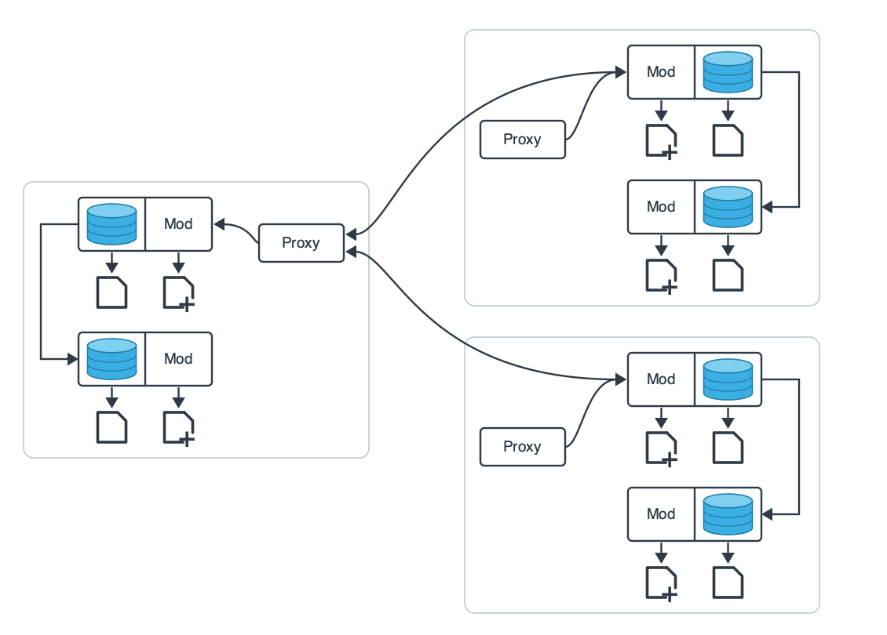
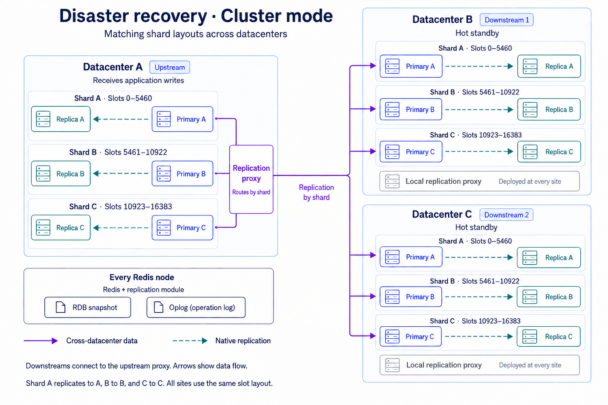

# Disaster Recovery and Active-Active Replication

<Directive type="warning" title="Feature Maturity Notice">
Cross-datacenter replication is currently in `alpha`. If you plan to use this solution in a production environment, please use it in conjunction with features such as alerting and regular backups. At the same time, disaster recovery switching requires manual intervention to prevent data loss due to unknown issues.
</Directive>

## Overview

The core functions of the system cover the entire replication link, including data interception, command parsing, operation log (Oplog) persistence, full and incremental data synchronization, and log slicing. The workflow begins with intercepting all write operations at the command execution entry point. Subsequently, the system deeply parses the commands and converts them into an idempotent, structured Oplog format. These logs are efficiently persisted to the local disk, forming a complete and reliable history of data changes, which provides a solid foundation for subsequent data recovery and failover.

In terms of data synchronization, the system has designed a synchronization mechanism that is both efficient and flexible. It supports full synchronization, which quickly builds a complete data copy on the downstream side by generating an RDB snapshot and combining it with the starting position of the Oplog. More importantly, we have innovatively introduced an Offset mechanism that is tightly integrated with the Oplog, building an incremental synchronization capability with an ultra-large window period. Unlike Redis's native replication, which relies on a limited memory backlog, our Oplog is persisted on disk, which means that the catch-up range of incremental synchronization is limited only by disk space. Therefore, even if a network interruption of several hours or even days occurs between the upstream and downstream instances, once the connection is restored, the downstream side can still request incremental data from the last recorded Offset point, achieving efficient data catch-up and consistency recovery, which greatly improves the reliability and robustness of the architecture.

In addition, in order to ensure the long-term stable operation of the system and controllable resources, we have designed a refined log slicing function. This function will automatically scroll and segment the local Oplog file according to the preset size policy. This mechanism not only effectively prevents a single log file from growing indefinitely and exhausting storage resources, but also greatly facilitates the archiving, cleaning, and management of logs, which is a key part of ensuring the continuous and stable operation of the service in a production environment.

Finally, the system provides comprehensive and powerful observability. By comparing the latest write position of the upstream Oplog with the synchronized Offset of the downstream in real time, the system can accurately calculate the data synchronization delay between the upstream and downstream instances with extremely low overhead. These key performance indicators (KPIs) can be seamlessly connected to mainstream monitoring panels (such as Prometheus/Grafana) and alarm systems. This allows the operation and maintenance team to grasp the system health status, synchronization link status, and data differences in real time and intuitively, so as to intervene in a timely manner before potential risks evolve into actual failures, which effectively guarantees business continuity and data security.

### Core Advantages

* **High reliability**: Based on the persistent Oplog and the large-window incremental synchronization mechanism, it can calmly deal with long-term network partitions and delays, ensuring accurate recording and reliable recovery of data changes.
* **High performance**: As a lightweight Redis Module, the core logic is highly optimized and executed directly in the Redis I/O thread, minimizing the impact on the core performance of Redis.
* **High stability**: The intelligent log slicing mechanism automatically manages storage resources, effectively preventing disk space exhaustion caused by log accumulation, and ensuring the continuous and stable operation of the service.
* **Strong observability**: It provides delay calculation accurate to the operation level and rich monitoring indicators, making the system status completely transparent, which is convenient for integration and automated operation and maintenance, and realizes active risk prevention and control.

## Replication modes

Starting with Alauda Cache Service for Redis OSS v5.1.0, the active-active module supports two wiring modes, selected per instance through `spec.activeRedis.mode` on the `Redis` resource.

| Mode | `spec.activeRedis.mode` | Topology | Membership resource | Redis versions |
|:-----|:------------------------|:---------|:--------------------|:---------------|
| Peer-of | `peerof` (default) | Directed links. One upstream fans out to multiple downstreams (star). | `ActiveRedisConnection` | `6.0`, `7.2` |
| Mesh | `mesh` | Full gossip mesh. Every member replicates with every other member. | `ActiveRedisMesh` | `7.2` only |

`peerof` is the hot-standby / disaster recovery topology documented in [Set Up Peer-of Replication](./20-setup.mdx). `mesh` is the new full active-active topology documented in [Set Up Mesh Replication](./40-mesh.mdx).

<Directive type="info" title="Mode is fixed at the instance level">
`mode` is empty or `peerof` by default. Mesh mode is rejected by admission on Redis `6.0`, because it only exists in the new module.
</Directive>

## Module generations and version applicability \{#module-generations-and-version-applicability}

The active-active module ships in two generations. Which one an instance loads is decided by its Redis version, and the generation determines the feature set, the authentication model, and the peer transport.

| | Redis `6.0` (legacy module) | Redis `7.2` (new module) |
|:--|:--|:--|
| Module | Frozen legacy implementation, maintained for existing instances only | Actively developed implementation |
| `peerof` mode | Supported | Supported |
| `mesh` mode | Not supported | Supported |
| Peer authentication | None at the module level; the link credential comes from the `ActiveRedisConnection` `spec.secretName` | Mandatory. The instance binds a `RedisUser` through `spec.activeRedis.redisUserName`; `spec.secretName` is ignored |
| Peer transport | Proxy RESP port (`6379`) | Dedicated peer port (`7379`) fronted by the proxy |
| Persistence | RDB recommended | RDB only — `appendonly=yes` is rejected by admission |
| Database count | Standard | `databases` must be `<= 16` |

<Directive type="warning" title="Cross-generation replication is not supported">
Replication between a Redis `6.0` instance and a Redis `7.2` instance is **not a designed path** — the protocols of the two module generations are not compatible. Every member of one replication group must run the same module generation. Creating an active-active instance on Redis `6.0` returns an admission warning recommending Redis `7.2`.

To move an existing Redis `6.0` replication group onto the new module, follow [Upgrade a Peer-of Group from Redis 6.0 to Redis 7.2](./50-upgrade-6.0-to-7.2.mdx).
</Directive>

## Architecture Description

To simplify the complexity of accessing the replication system for different Redis architectures, we have designed a dedicated proxy layer. As the core component of the system, the proxy layer provides a unified status detection and data synchronization entry point for Sentinel and cluster modes. Regardless of the deployment form of the back-end Redis, peers interact through this unified proxy interface. The proxy layer is responsible for encapsulating the internal logic of communication with the specific architecture (Sentinel, cluster), thereby decoupling the replication system from the implementation details of the back-end Redis, which greatly simplifies the access and management of instances.

A proxy is deployed for both module generations. Enabling active-active replication creates a proxy Deployment and a proxy Service named `activeredis-proxy-<instance-name>`.

> For Sentinel instances, the instance name is prefixed with `rfr-`.

### Ports

| Port | Name | Purpose | Applies to |
|:-----|:-----|:--------|:-----------|
| `6379` | `proxy` | RESP endpoint. Pre-flight inspection, and — on Redis `6.0` — the replication transport. Also the address used in mesh seed entries. | All versions |
| `7379` | `peer` | The peer port. On the new module this is the **only** peer transport: it carries both `peerof` replication and mesh gossip. | Redis `7.2` |

<Directive type="warning" title="Expose the peer port unchanged">
When an external load balancer or firewall fronts the proxy of a Redis `7.2` instance, it must expose port `7379` as `7379`. The module always advertises its own local peer port for the data plane, so remapping it breaks replication. Only the RESP port may be remapped, through `announcePort` in mesh mode or `spec.peerPort` on an `ActiveRedisConnection`.
</Directive>

### Instance ID: Service ID

To uniquely identify and manage each Redis instance in the replication system, we have introduced the concept of `service_id`. This ID is the core credential for routing and data synchronization in the entire system.

* Unique identifier: Each Redis instance, whether it is an upstream or a downstream, must be configured with a globally unique `service_id`. The system uses this ID to establish a mapping between members.
* Value range: The valid range of `service_id` is `[0-15]`.
* Topology limitation: Due to the ID range, a single upstream can be associated with up to 15 downstream instances, supporting a "one-upstream-multiple-downstream" topology.

<Directive type="warning" title="Service ID is immutable">
`spec.activeRedis.serviceID` cannot be changed after the instance is created, and active-active replication cannot be turned off once enabled. Both are rejected by admission, because the module's Oplog state is bound to the identity.
</Directive>

### Deployment Architecture

#### Redis Sentinel Mode Deployment Architecture

When a replication request is initiated, the proxy layer will query the Sentinel cluster to obtain the information of the currently active master node. After locating it, the proxy will route the request to the master node, and directly copy data between the two network sockets to ensure network communication performance.

#### Redis Cluster Mode Deployment Architecture

For cluster mode, the proxy layer is responsible for handling more complex shard routing. It will parse the cluster topology and accurately locate the master node responsible for the shard based on the shard information involved in the request. Then, the synchronization traffic is directly routed to the correct master node. This mechanism avoids the memory and CPU overhead of data transfer in the proxy layer, ensuring high-performance, low-latency data synchronization in a distributed environment.

## Terminology

The replication direction is described as **upstream** (the instance that produces changes) and **downstream** (the instance that consumes them). These are the terms used by the `ActiveRedis` resource status fields `upstreamPeer`, `downstreamPeers`, and `downstreamPeerCount`.

The Web Console presents the same concepts as **Source side** and **Target side** when you configure a peer-of instance. A source is an upstream; a target is a downstream. In `peerof` mode the role of an instance is not fixed — a target may itself be promoted to a source during a failover.

## Limitations and Risks

For the risks and limitations of cross-datacenter replication, please refer to the document [Limitations and Risks](./90-limitations).
