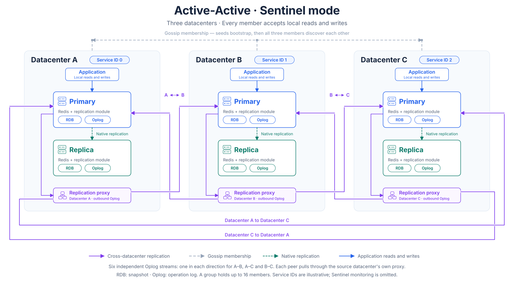
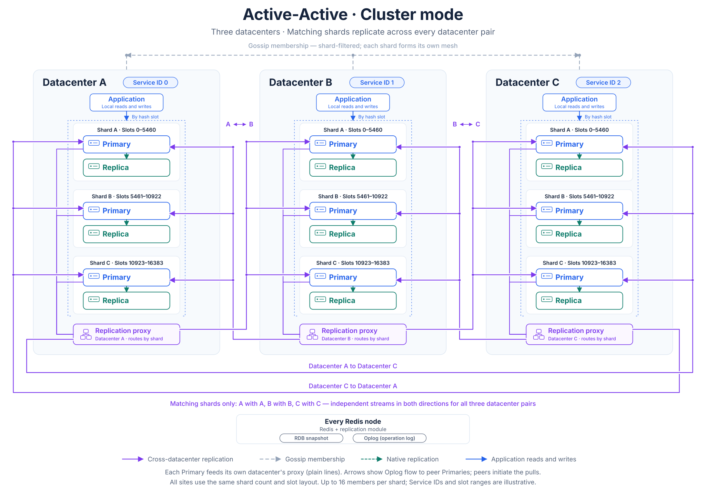

# Active-Active Architecture

How an Active-Active replication group is put together: how members find each other, what travels between them, how concurrent writes are reconciled, and why synchronized clocks are a prerequisite rather than a recommendation. For the replication engine itself — the Oplog, full and incremental synchronization, the ports, and the Service ID — see [Introduction](../10-intro.mdx).

<Directive type="warning" title="Feature Maturity Notice">
Active-Active mode is `alpha` and is available on Redis `7.2` only. It is not supported on Redis `6.0` — admission rejects it.
</Directive>

## Deployment architecture

Three datacenters of one Active-Active group, in Sentinel mode. All three accept local reads and writes, and each one's changes reach both peers along independent paths: a member's Primary feeds **that member's** replication proxy, and that proxy serves the Primaries in the other two datacenters. A member's proxy therefore carries only its own outbound Oplog — proxies do not link to each other. Each pair (A–B, A–C and B–C) has an independent Oplog stream in each direction, for six streams in total.

The member count and the Service IDs are illustrative: a group holds up to 16 members, and every pair is wired the same way. [Discovered membership, not declared links](#discovered-membership-not-declared-links) explains how members find each other; [Redis Cluster members](#redis-cluster-members) has the sharded figure.

## Every member is a writer

In Disaster Recovery mode one instance owns the writes and the rest stand by. In Active-Active mode there is no standby: an application in each datacenter reads and writes its **local** instance, and every member replicates its changes to every other member.

Each member is therefore an upstream and a downstream at the same time — an upstream for the changes its own clients make, and a downstream for the changes it receives from each peer. The transport underneath is the same one Disaster Recovery uses: a member pulls a peer's Oplog, applies the module's conflict-resolution rules to each operation, executes it locally, and appends it to its own Oplog.

Two consequences follow, and they are the whole reason the rest of this page exists:

* **Concurrent writes to the same key are normal**, not exceptional. They are reconciled automatically, by rules that differ from standalone Redis.
* **There is no promotion step** when a datacenter is lost. The surviving members were already accepting writes, so recovery is a matter of redirecting clients.

## Discovered membership, not declared links \{#discovered-membership-not-declared-links}

Disaster Recovery declares every link: one `ActiveRedisConnection` per edge, naming both ends. Active-Active declares only a **starting point**. Each cluster owns one `ActiveRedisMesh` for its local instance, carrying a short list of `seeds` — externally-routable addresses of members in other datacenters. From there the members gossip: they exchange membership records, learn about members nobody told them about, and form the remaining links themselves.

The practical differences this produces:

* **Adding a member does not require touching the existing ones.** A new member joins by naming any reachable existing member as a seed, and the whole group learns about it through gossip. Updating the other members' seed lists afterwards is still recommended, so that a member restarting while the original seeds are unreachable can still rejoin.
* **Seeds are a bootstrap list, not a membership list.** One reachable seed per remote datacenter is enough, and the local member's own entry may be included — which lets every datacenter carry one identical seed list.
* **Membership is state that converges**, so it is reported rather than declared. The `ActiveRedisMesh` status carries the member list, each member's state, and an `epoch` that advances as membership changes.

## What travels on which port

A member is identified in the mesh by its **announced RESP address** — `announceAddress` with `announcePort`, normally `6379`. That is the address written in seed entries and carried in the membership records that gossip exchanges, and it must be routable from every other datacenter.

The traffic itself — both the gossip rounds and the replicated Oplog — is carried on the **peer port**, `7379`. The module always advertises its own local peer port for that traffic, which is why an external load balancer or firewall in front of the proxy must expose `7379` as `7379`. Only the RESP port may be remapped.

As in Disaster Recovery mode, peers address the proxy of an instance rather than an individual pod, and the proxy resolves each connection to the primary that is current at that moment.

## Membership lifecycle \{#membership-lifecycle}

Gossip tracks each member through three states:

| State | Meaning |
|:------|:--------|
| `alive` | The member is gossiping normally. |
| `suspect` | Gossip has stopped hearing from the member. Intermediate — it recovers, or it progresses to `dead`. |
| `dead` | The member has been unreachable past the dead timeout. Replication between the surviving members continues throughout. |

The default timers are a gossip round every second, `suspect` after 8 seconds of silence, and `dead` after 15; they can be adjusted, with care, through `spec.tuning` — see [Operations](./30-operations.mdx#tuning). A member that has departed for good is not evicted by an operator action: its record ages out of the surviving members' membership on those same timers, and a ban period keeps a stale node from re-announcing obsolete membership while it does. See [Removing a member](./30-operations.mdx#removing-a-member).

The mesh as a whole reports a phase — `Healthy`, `Degraded`, `Pending`, `Paused`, or `Failed` — summarizing those member states. `Degraded` means the mesh is operating with suspect or dead members, not that replication between the healthy members has stopped.

## Restarts and local failovers are zero-touch

The operator pushes the seed list to **every** node of the instance, replicas included, not only to the current primary. The module re-reads it on each pod and starts gossip from it.

That is what makes re-entry automatic: when a pod restarts, or a Sentinel or Cluster failover promotes a replica, the newly-serving node already holds the seed list and rejoins the mesh on its own. No `ActiveRedisMesh` has to be edited and no other datacenter has to be reconfigured.

## Redis Cluster members \{#redis-cluster-members}

In Cluster mode the mesh is not one ring but one **ring per shard**: shard 0 replicates with shard 0 in the other datacenters, shard 1 with shard 1, and so on. The module replicates within a shard position and does not route hash slots — Redis Cluster itself does that — so every member of the group must have a matching shard count and slot layout. The `ActiveRedisMesh` status reports a `shardID` alongside each member's `serviceID` for this reason.

The slot ranges and the three-shard layout are illustrative; what matters is that every member uses the same shard count and slot layout. Because gossip is filtered by shard, a member's shard 0 only ever meets shard 0 elsewhere — the rings never cross.

## How concurrent writes are reconciled

When two datacenters write the same key at the same moment, both writes are replicated and both arrive. The module decides the outcome per key, and per field for the structured types, rather than letting the last message to arrive win:

* Most values are **last-write-wins**, decided by comparing a Hybrid Logical Clock whose physical component is the writing member's wall-clock millisecond.
* Counters are **additive**, so concurrent increments on different members all count.
* Sets are **add-wins**, so a concurrent add and remove of the same element leaves the element present.
* Deletions are retained as **tombstones** until every active member has acknowledged them, so that a delete is not undone by a peer that had not yet seen it.

<Directive type="info" title="The conflict rules follow the module generation, not the mode">
These rules are properties of the Redis `7.2` module, so they are in force in Disaster Recovery mode too. What Active-Active changes is exposure: with writes arriving in several datacenters at once, the rules are exercised continuously rather than only in the rare case of a write to a downstream.
</Directive>

[Command Support](../60-commands.mdx) is the per-command reference — which commands are refused, which execute locally and never replicate, and which policy each replicated write uses. Read it before pointing an application at an Active-Active group.

## Why synchronized clocks are a prerequisite

Because last-write-wins is decided by wall-clock time, the correctness of the reconciliation depends on the members agreeing about what time it is. The module measures the skew between members and raises alarms, but it never blocks a write and never drops a peer because of it — keeping the clocks synchronized is the operator's responsibility.

Two effects follow from skew, both proportional to how far the clocks are apart, and neither produces an error when it happens:

* **A fast clock wins conflicts it should have lost.** A value written later in real time on one member is silently overwritten by an earlier write from a member whose clock runs ahead.
* **Deleted data can come back.** Tombstones are released on a wall-clock age floor. Once skew approaches half of that floor, a tombstone can be released on one member while a concurrent addition from a skewed member is still in flight, and the deleted element reappears. This is a genuine convergence break, not a transient inconsistency.

Run a time-synchronization daemon on every node of every cluster in the group, preferably against a common time source, and alert on the skew gauges. [Operations](./30-operations.mdx#clock-synchronization-requirement) covers the thresholds, how to read the measurements, and how to confirm that skew caused a particular problem.

This requirement is specific to Active-Active. In Disaster Recovery mode only the upstream takes application writes, so there are no concurrent conflicting writes for a skewed clock to arbitrate.

## Losing a datacenter

There is no failover procedure in Active-Active mode, because there is nothing to promote. The surviving members keep accepting writes throughout, and recovery has two parts:

1. **Redirect the affected clients** to a surviving member. The platform does not ship a client-side switcher; see [Client-side Disaster Recovery Switch](../20-disaster-recovery/30-failover.mdx#client-side-disaster-recovery-switch) for the switching strategies and their trade-offs, which apply here as well.
2. **Remove the lost member** from the group, if it is not coming back — see [Removing a member](./30-operations.mdx#removing-a-member).

Writes that the lost datacenter had accepted but not yet replicated are lost with it, exactly as an unreplicated write on a failed upstream would be in Disaster Recovery mode.
