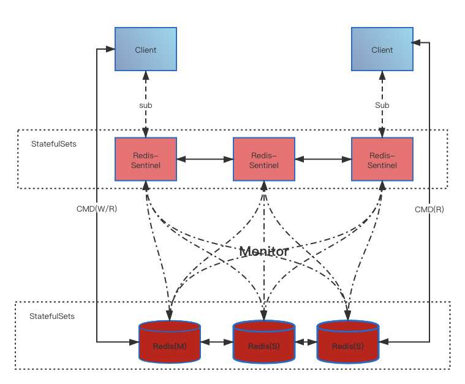
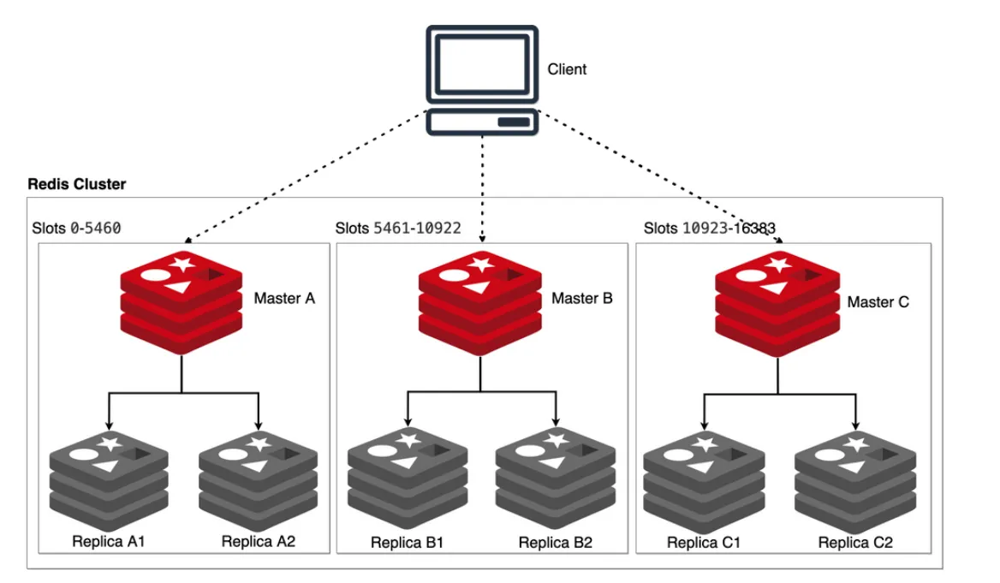

Служба кеширования Alauda для Redis OSS предлагает две различные архитектуры развертывания, каждая из которых разработана для удовлетворения специфических требований по производительности, масштабируемости и высокой доступности.

- **Режим Sentinel**: конфигурация высокой доступности, состоящая из основного экземпляра Redis и настраиваемых узлов-реплик. Реплики обеспечивают масштабируемость чтения и поддерживают синхронизацию с основным узлом для обеспечения согласованности данных. Redis Sentinel отслеживает состояние экземпляров и организует автоматическое переключение в случае необходимости.

- **Режим кластера**: распределённая архитектура, которая реализует горизонтальную масштабируемость через разбиение данных между несколькими узлами Redis. Эта конфигурация обеспечивает повышенную пропускную способность чтения и записи, возможности автоматического переключения и интеллектуальное разделение данных для оптимальной производительности и доступности в условиях высокой нагрузки.

## Режим Sentinel

Режим Sentinel реализует решение для высокой доступности на основе встроенной репликации master-replica Redis. Подсистема Redis Sentinel постоянно отслеживает состояние всех экземпляров Redis и автоматически повышает реплику до статуса основного в случае сбоя, обеспечивая непрерывность обслуживания. Ключевые характеристики включают:

- **Простота эксплуатации**: Архитектура предлагает простую реализацию и управление по сравнению с решениями распределенного кластера.
- **Автоматическое переключение**: Sentinel обеспечивает надежное мониторинг состояния и автоматическое обнаружение сбоя с настраиваемыми порогами для повышения реплики до основного.
- **Вертикальная масштабируемость**: Хотя поддерживается вертикальная ресурсная масштабируемость, эта архитектура имеет ограниченную горизонтальную масштабируемость, так как все операции записи должны направляться на основной узел.
- **Устойчивость Sentinel**: Для полной высокой доступности необходимо развернуть несколько экземпляров Sentinel, чтобы избежать создания единой точки отказа.

## Режим кластера

Режим кластера представляет собой комплексное распределённое решение Redis. Через протокол Redis Cluster система достигает горизонтальной масштабируемости, распределяя данные между несколькими узлами, используя распределение по слотам хэширования и алгоритмам согласованного хэширования для автоматического разделения данных и перераспределения. Ключевые характеристики включают:

- **Высокая доступность**: Архитектура реализует механизмы автоматического обнаружения и восстановления узлов при сбоях, обеспечивая непрерывный доступ к данным.
- **Динамическая масштабируемость**: Поддержка добавления или удаления узлов в реальном времени с автоматическим перераспределением данных для учета изменяющихся требований нагрузки.
- **Распределение нагрузки**: Реализует интеллектуальное распределение нагрузки по кластеру для предотвращения узких мест и обеспечения оптимального использования ресурсов.
- **Распределение данных**: Разделяет наборы данных между несколькими узлами, предотвращая ограничения по памяти одного узла и обеспечивая поддержку значительно больших наборов данных.
- **Сложность эксплуатации**: Требует понимания механизмов разбиения, принципов согласованного хэширования, стратегий миграции данных и управления топологией кластера.

## Руководство по выбору архитектуры

| Требование                                             | Режим Sentinel | Режим кластера |
| :------------------------------------------------------ | :-----------: | :----------: |
| Горизонтальная масштабируемость за пределами ограничений памяти одного узла |       ❌       |       ✅      |
| Упрощенное развертывание и управление                    |       ✅       |       ❌      |
| Поддержка больших наборов данных (>8ГБ)                  |       ❌       |       ✅      |
| Высокая доступность с автоматическим переключением       |       ✅       |       ✅      |
| Оптимизировано для нагрузок на чтение с репликами чтения |       ✅       |       ✅      |
| Поддержка транзакционных операций между несколькими ключами |       ✅       |      ❌\*     |

\* *Redis Cluster имеет ограничения на операции с несколькими ключами, когда ключи принадлежат различным слотам хэширования.*
