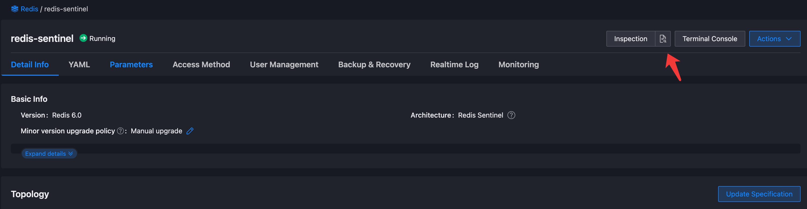
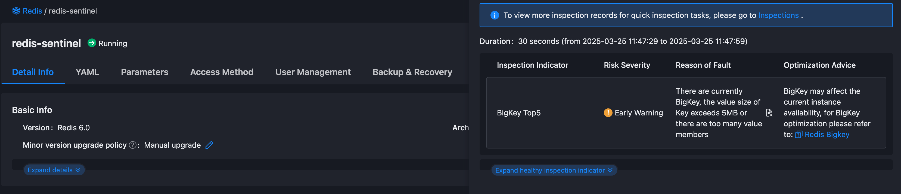

# Обнаружение и работа с BigKey

BigKey могут значительно повлиять на производительность и стабильность сервиса Redis, что может привести к ухудшению работы сервиса или сбоям. В этом документе представлен концепт BigKey, методологии их обнаружения и лучшие практики для работы с ними в производственных средах.

## Что такое BigKey

BigKey в Redis не относится к размеру ключа, а скорее к размеру значения, связанного с ключом. BigKey обычно оцениваются по двум критериям: потребление памяти и количество элементов. Общие пороговые значения включают:

- **Строка**: Размер превышает 5MB
- **Список**: Количество элементов превышает 20,000
- **Множество**: Количество элементов превышает 10,000
- **Отсортированное множество**: Количество элементов превышает 10,000
- **Хэш**: Количество полей превышает 10,000

> Примечание: Эти пороговые значения предоставлены в качестве рекомендаций и могут потребовать корректировок в зависимости от вашей конкретной среды и требований.

## Влияние BigKey

BigKey могут неблагоприятно сказаться на производительности и стабильности сервиса Redis несколькими способами:

- **Блокировка потоков**: Redis обрабатывает данные, используя модель однофазного потока. Операции с BigKey могут быть времязатратными, блокируя выполнение других команд и ухудшая общую производительность сервиса.
- **Таймауты клиентов**: Из-за однофазной архитектуры операции с BigKey могут привести к тому, что Redis перестанет отвечать на запросы клиентов, что приведет к таймаутам соединения.
- **Насыщение сетевой пропускной способности**: Передача BigKey требует значительной сетевой пропускной способности. Например, ключ размером 1MB, доступный 1,000 раз в секунду, генерирует 1GB/s сетевого трафика, что может перегрузить стандартную сетевую инфраструктуру.

В кластерных развертываниях появляются дополнительные проблемы:

- **Несбалансированное использование памяти**: BigKey могут вызвать непропорциональное потребление памяти на отдельных узлах, что приведет к неэффективному использованию ресурсов по всему кластеру.
- **Узкие места при миграции**: Во время операций масштабирования миграция BigKey может блокировать Redis на длительное время, нарушая нормальную работу и потенциально компрометируя стабильность кластера.

## Обнаружение BigKey

### Обнаружение с помощью инструментов инспекции

Alauda Application Services предоставляет **Инспекции** для обнаружения BigKey в экземплярах Redis.

1. Отредактируйте конфигурацию развертывания инструмента инспекции для включения обнаружения BigKey.

На кластере, где расположен экземпляр, измените функцию RdsInstaller для включения обнаружения BigKey.

```bash
# Сначала проверьте конфигурацию RdsInstaller
$ kubectl -n rds-system get RdsInstaller rds -o yaml
```

Вывод будет следующим:

```yaml
apiVersion: middleware.alauda.io/v1
kind: RdsInstaller
metadata:
  name: rds
spec:
  ......
  inspection:
    concurrency: "10"
    dependency: true
    env:
    - name: ENABLE_REDIS_KEYS_INDICATOR
    image: xxx
    imagePullPolicy: Always
    instanceReportLimit: "10"
    name: inspection-operator
    namespace: rds-system
    ......
```

2. Измените значение переменной окружения `ENABLE_REDIS_KEYS_INDICATOR` и сохраните.

```bash
$ kubectl -n rds-system edit RdsInstaller rds
```

Измените значение `ENABLE_REDIS_KEYS_INDICATOR` в `spec.inspection.env` на `1`. Измененный экземпляр будет выглядеть следующим образом:

```yaml
apiVersion: middleware.alauda.io/v1
kind: RdsInstaller
metadata:
  name: rds
spec:
  ......
  inspection:
    concurrency: "10"
    dependency: true
    env:
    - name: ENABLE_REDIS_KEYS_INDICATOR
      value: "1"
    image: xxx
    imagePullPolicy: Always
    instanceReportLimit: "10"
    name: inspection-operator
    namespace: rds-system
    ......
```

После сохранения, инструмент оператора инспекции перезапустится. Вы можете проверить процесс перезапуска с помощью следующей команды:

```bash
$ kubectl -n rds-system get pods -l name.operator=inspection-operator
```

Вывод будет следующим:

```bash
$ kubectl -n rds-system get pods -l name.operator=inspection-operator
NAME                                   READY   STATUS    RESTARTS   AGE
inspection-operator-545468bd54-9g65p   1/1     Running   0          8s
```

> Примечание: Указанное выше изменение не будет действовать постоянно; конфигурация будет перезаписана при обновлении платформы.

3. Выполните инспекцию

В **Redis** -> **Информация о подробностях**, нажмите кнопку **Инспекция**, чтобы начать инспекцию экземпляра.

Когда инспекция начнется, на кнопке будет отображаться **Идёт проверка...**. После завершения кнопка инспекции станет доступной для нажатия.

> Из-за включенной функции обнаружения BigKey инструмент инспекции будет `SCAN` (сканировать) все данные в кэше; соответственно, этот процесс может занять значительное количество времени.

4. Просмотр результатов инспекции

По завершении инспекции вы можете нажать кнопку **Запрос** в отчете инспекции на **Redis** -> **Информация о подробностях**, чтобы просмотреть результаты инспекции.



Если BigKey действительно существует в экземпляре, результат инспекции отобразит список `BigKey Top5` элементов, как показано на изображении ниже:



#### Ограничения использования

- Инструмент инспекции выполняет полное сканирование данных Redis, что может создать определенное давление на сервис Redis; рекомендуется использовать его в периоды низкой нагрузки.
- В настоящее время инструмент инспекции поддерживает только обнаружение типов `string`, `list` и `zset`.

### Обнаружение с помощью командной строки

Сообщество Redis предлагает функциональность для обнаружения BigKey с использованием `redis-cli`. В процессе обнаружения он проходит через все ключи в экземпляре Redis и возвращает общую статистику ключей и самый большой ключ каждого типа данных. BigKey можно анализировать в текущей версии для типов `string`, `list`, `set`, `zset`, `hash` и `stream`. Команда выполнения следующая:

```bash
$ redis-cli -h <host> -a <password> --bigkeys
```

#### Ограничения использования

- Обнаружение с помощью `redis-cli` также выполняет полное сканирование данных Redis, что может создать определенное давление на сервис Redis; рекомендуется использовать его в периоды низкой нагрузки.

## Оптимизация BigKey

Необходимо выбрать подходящие схемы оптимизации на основе конкретных бизнес-сценариев и характеристик данных, в общем, сосредоточив внимание на следующих аспектах:

### Оптимизация структур данных для хранения

Для типов коллекций с множеством членов данных (таких как `list`, `set`, `zset`, `hash` и т. д.) их следует разбивать на несколько ключей и обеспечивать, чтобы количество членов на ключ было в разумных пределах. В архитектуре кластера Redis разбивка больших ключей может значительно улучшить баланс памяти между фрагментами данных.

### Сжатие данных

Если хранится значительное количество кэша JSON или HTML, рассмотрите возможность сжатия данных. Кроме того, можно использовать протоколы сериализации, такие как ProtoBuffer или MessagePack, чтобы уменьшить размер данных.

### Регулярная очистка устаревших данных

Для данных с определённым временем истечения вы можете автоматически очищать устаревшие данные, устанавливая даты истечения. Для данных с неопределёнными сроками их можно очищать периодически. Это особенно актуально для таких структур данных, как `list`, `set`, `zset` и `hash`, которые могут накапливать большое количество устаревших данных; поэтому рекомендуется сочетание `SCAN` и `DEL` для очистки недействительных членов.

Независимо от того, какая схема оптимизации выбрана, необходимо быть особенно осторожным при использовании команды `DEL` для очистки существующего BigKey, так как команда `DEL` будет блокировать сервис Redis. Рекомендуется использовать команду `UNLINK`, так как она асинхронно удаляет ключи, не блокируя сервис Redis.
