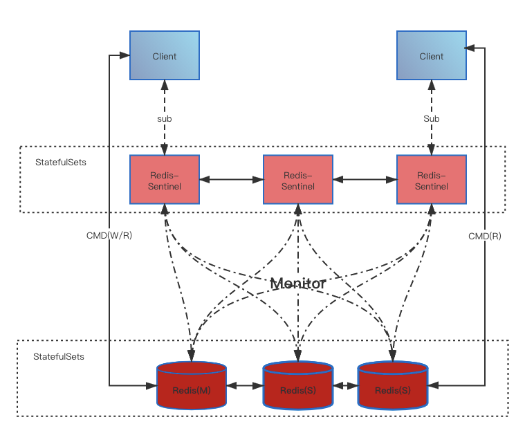
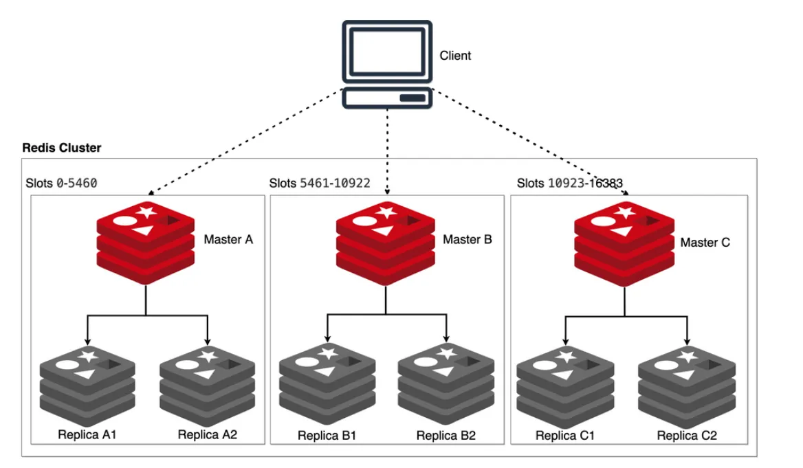

# 架构

全栈云原生开放平台根据客户的痛点问题，主要提供了两种 Redis 管理架构，以满足不同场景的高可用需求。

* 哨兵模式：该模式包括一个 Redis 主节点和可配置的一个或多个从节点。从节点用于读取操作，并与主节点保持同步以提供高可用性。哨兵模式提供了读取的可扩展性，可以与 Redis Sentinel 结合使用以实现自动故障切换和高可用性。
* 集群模式：该模式是一种分布式架构，可以将数据分片存储在多个 Redis 节点上。集群模式提供了读写的可扩展性、自动故障切换以及数据分区的功能，从而实现更高的性能和可用性。

## 哨兵模式

哨兵模式是 Redis 提供的一种基于主从复制的高可用方案。通过监控 Redis 实例的状态，哨兵模式能够在主节点发生故障时，自动将一个从节点升级为主节点，以保证服务的可用性。哨兵模式具有以下主要特点：

* 简单易用：相对于集群模式来说，实现和管理较为简单。
* 高可用性：支持节点故障自动切换，可以提供高可用的数据服务。
* 有限扩展：只支持主从复制，不能像集群模式一样进行横向扩展。
* 单点故障：哨兵节点本身也可能发生故障，因此需要考虑哨兵节点的高可用性和容错性。

## 集群模式

集群模式是 Redis 分布式解决方案的核心。通过 Redis Cluster，我们可以实现 Redis 的水平扩展，将数据分布在多个节点上，利用分片技术和一致性哈希算法来自动划分和平衡数据。集群模式具有以下主要特点：

* 高可用性：支持节点故障自动恢复，确保数据服务的高可用性。
* 横向扩展：支持动态的节点扩容和缩容，能够根据业务需求灵活调整节点数量。
* 负载均衡：能够平衡节点负载，避免出现单节点负载过高的情况。
* 数据分散：将数据分散存储在多个节点上，避免单节点数据过大的问题。
* 复杂度高：需要考虑分片、一致性哈希、数据迁移、节点平衡等问题，实现和管理较为复杂。

## 架构选择

|           | 需要由无限的横向扩张能力 | 单节点或少量节点部署 | 数据存储规模较大（8GB以上） | 高可用 |
|:----------|:-------------------------|:---------------------|:----------------------------|:-------|
| 哨兵模式  |                          | ✓                    |                             | ✓      |
| 集群模式  | ✓                        |                      | ✓                           | ✓      |

