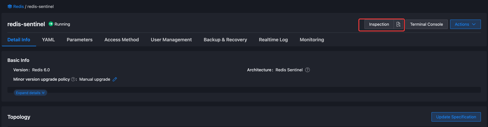
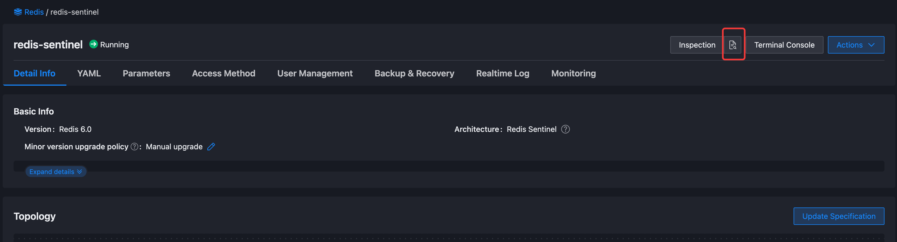
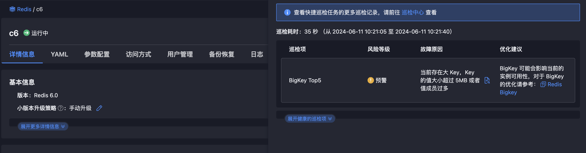

# BigKey 的发现与处理

BigKey 的存在会对 Redis 服务的性能和稳定性造成影响，甚至会导致服务故障。该文档主要介绍了 BigKey 的概念、检测方法和处理方法。

## 什么是 BigKey

大 Key 不是指 Key 本身很大，而是指 Key 对应的值很大。一般从值的内存占用大小和成员的数量来综合判定。例如：

* 字符串（String）：大小超过 5MB。
* 列表（List）：元素数量超过 20,000 个。
* 集合（Set）：元素数量超过 10,000 个。
* 有序集合（Sorted Set）：元素数量超过 10,000 个。
* 哈希表（Hash）：字段数量超过 10,000 个。

> 以上标准仅供参考

## BigKey 的影响

BigKey 会对 Redis 服务的性能和稳定性造成影响，主要表现在以下几个方面：

* **阻塞线程**：由于 Redis 数据处理是单线程的，当执行一个耗时的命令时，会阻塞其他命令的执行，导致 Redis 服务的性能下降。
* **客户端超时**：由于 Redis 数据处理是单线程的，在操作大 key 时会比较耗时，会导致客户端无响应。
* **网络带宽占用**：由于 BigKey 的传输会占用大量的网络带宽，导致 Redis 服务的网络传输压力过大。一个 key 的大小是 1MB，每秒访问量为 1000，那么每秒会产生 1000MB 的流量，这对于普通千兆网卡的服务器来说是灾难性的。

特别的，对于集群模式，会存在以下影响：

* **内存分布不均**：BigKey 会导致集群中的某个节点的内存占用过大，而其他节点的内存占用较小，导致集群中的内存分布不均。
* **数据迁移压力大**：集群模式扩缩容过程中，BigKey 的迁移会较长时间阻塞 Redis，影响业务的正常访问，影响集群的稳定性，甚至会导致服务故障。

## BigKey 的检测

### 使用巡检工具检测

数据服务视图页面提供了 BigKey 的检测功能，可以通过数据服务视图页面的 BigKey 检测功能来检测 Redis 实例中的 BigKey。

1. 编辑巡检功能部署配置，开启 BigKey 检测。

在实例所在的集群上，编辑 RdsInstaller 功能，开启 BigKey 检测。

```bash
# 先查看 RdsInstaller 的配置
kubectl -n operators get RdsInstaller rds -o yaml
```

输出如下:

```yaml
apiVersion: middleware.alauda.io/v1
kind: RdsInstaller
metadata:
  name: rds
spec:
  ......
  inspection:
    concurrency: "10"
    dependency: true
    env:
    - name: ENABLE_REDIS_KEYS_INDICATOR
    image: xxx
    imagePullPolicy: Always
    instanceReportLimit: "10"
    name: inspection-operator
    namespace: operators
    ......
```

2. 修改 `ENABLE_REDIS_KEYS_INDICATOR` 环境变量的值并保存。

```bash
kubectl -n operators edit RdsInstaller rds
```

将 `spec.inspection.env` 中的 `ENABLE_REDIS_KEYS_INDICATOR` 的值修改为 `1`。修改后的实例如下：

```yaml
apiVersion: middleware.alauda.io/v1
kind: RdsInstaller
metadata:
  name: rds
spec:
  ......
  inspection:
    concurrency: "10"
    dependency: true
    env:
    - name: ENABLE_REDIS_KEYS_INDICATOR
      value: "1"
    image: xxx
    imagePullPolicy: Always
    instanceReportLimit: "10"
    name: inspection-operator
    namespace: operators
    ......
```

保存之后，巡检的 Operator 工具会重启。可通过如下命令查看重启进度：

```bash
kubectl -n operators get pods -l name.operator=inspection-operator
```

输出如下：

```bash
$ kubectl -n operators get pods -l name.operator=inspection-operator
NAME                                   READY   STATUS    RESTARTS   AGE
inspection-operator-545468bd54-9g65p   1/1     Running   0          8s
```

> 注意，以上修改不是永久生效的，在平台升级后，该配置会被覆盖。

3. 执行巡检

在**数据服务** -> **Redis** -> **实例详情页面**点击**巡检**按钮，开始实例的巡检，如下图所示：



开始巡检之后，按钮上会显示**巡检中...**。待巡检完成后，巡检按钮会变为可点击状态。

> 由于开启了 BigKey 检测功能，巡检工具会`SCAN`缓存中所有数据，因而该过程耗时可能会比较长。

4. 查看巡检结果

巡检完成后，可以在**数据服务** -> **Redis** -> **实例详情页面**的巡检报告的**查询**按钮，查看巡检结果。



如果实例中确实存在 BigKey，巡检结果中会中列出`BigKey Top5`项目，如下图所示：



#### 使用限制

* 巡检工具会对 Redis 数据进行全库遍历，会对 Redis 服务造成一定的压力，建议在业务低峰期使用。
* 目前巡检工具只支持检测`string`、`list`、`zset` 类型。

### 使用命令行检测

Redis 社区提供了使用 `redis-cli` 来检测 BigKey 的功能。在检测时，他会以遍历/采样的方式分析 Redis 实例中的所有 Key，并返回 Key 的整体统计信息与每个数据类型中 Top1 的大 Key。bigkeys 目前能分析`string`、`list`、`set`、`zset`、`hash`、`stream` 这些类型。执行方式如下：

```bash
$ redis-cli -h <host> -a <password> --bigkeys
```

#### 使用限制

* `redis-cli`检测会对 Redis 数据进行全库遍历，会对 Redis 服务造成一定的压力，建议在业务低峰期使用。

## BigKey 的优化

需要根据具体的业务场景和数据特点来选择合适的优化方案，一般可以从以下几个方面入手：

### 存储数据结构的优化

对有很多数据成员的集合类型（比如`list`,`set`,`zset`,`hash`等），将其拆分为多个 Key，并确保每个 Key 的成员数量在合理范围。在 Redis 集群架构中，拆分大 Key 能对数据分片间的内存平衡起到显著效果。

### 对数据进行压缩

如果业务上缓存了很多 JSON 或者 HTML 缓存，可以考虑对数据进行压缩。此外，也可以使用 ProtoBuffer 或者 MessagePack 等序列化协议来减少数据的大小。

### 对过期数据进行定期清理

对于确定有过期时间的数据，可以通过设置有效期来自动清理过期数据。对于不确定有过期时间的数据，可以通过定期清理的方式来清理过期数据。
特别是对于`list`、`set`、`zset`、`hash`等数据结构，容易产生大量的过期数据，可结合`SCAN`和`DEL` 的方式清理清理无效的成员。


不管是以上哪种优化方案，需要特别注意的是，在对已有的 BigKey 做清理时，谨慎使用`DEL`命令，`DEL`命令会阻塞 Redis 服务。建议使用`UNLINK`命令，`UNLINK`命令会异步删除 Key，不会阻塞 Redis 服务。

